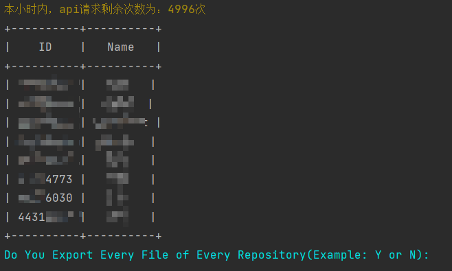
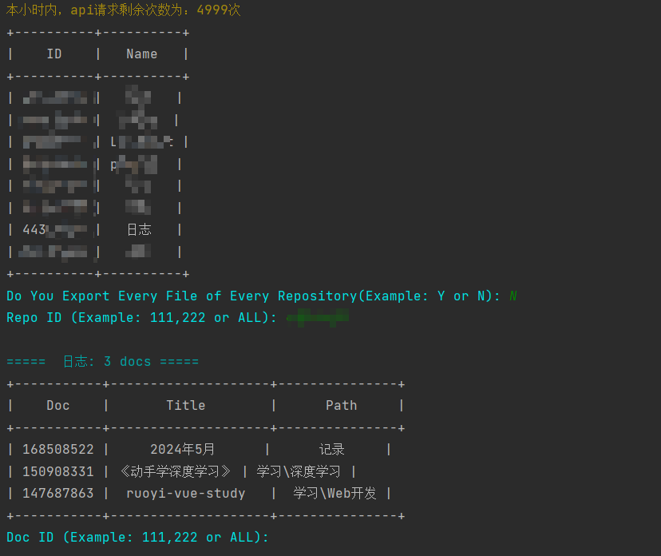
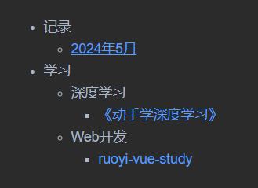
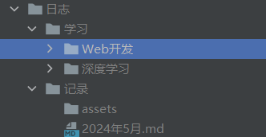

## 介绍
>这是一个用于将语雀文档以md格式备份到本地的工具，可以导出全部知识库和相关图片与附件，并且**按照知识库的文件目录结构保存**。
><br> 
> 本项目源于https://github.com/M1r0ku/YuqueExport
> <br>
> 感谢原作者开源该优秀项目！
> <br>
> 之前苦苦寻找备份工具，原项目是我找到最符合本人需求的！在原项目基础上，我修改了文件保存路径，使之完全按照语雀知识库中的文件目录结构。

## 用法
> 最近发现语雀需要开通超级会员才可以创建Token，但是之前已创建的Token，非会员也可以继续使用。
- 不充年费超级会员获得Token的方法(最便宜方法)

> 邀请一位新用户，获得15天的会员，然后再充值超级会员。此时，需要的费用是15天的超级会员差价，同理，时间剩余越短，需要补的差价越少。开通超级会员后，申请Token，会员过期后仍能使用。

- 安装相关依赖


```bash
$ pip3 install pyuque aiohttp huepy PrettyTable

```

- 浏览器访问 [语雀-Token](https://www.yuque.com/settings/tokens) 页面，新建一个读取权限的密钥，然后将该密钥填入`token`变量，最后执行脚本即可

```bash
$ python3 YuqueExport.py

```
 - 使用案例
   - 是否保存所有知识库的所有文件? <br>
   - 保存某个知识库 <br>
   - 索引文件 <br>
   - 文件目录结构 <br>
      


## 更新
- 2024-10-08
  - 新增：按照知识库的目录结构进行保存
- 👆👆👆新项目更新日志👆👆👆
- 👇👇👇原项目更新日志👇👇👇
- 2024-05-15
  - 修复：修复 [Issues#6](https://github.com/M1r0ku/YuqueExport/issues/6) 中单个知识库文档数大于100的限制，感谢 [@guanfenglinux](https://github.com/M1r0ku/YuqueExport/issues/6#issuecomment-2071769391) 师傅的代码
- 2022-12-16
  - 新增：可导出文档中的附件
  - 修复：对图片链接中的特殊符号进行编码
- 2022-10-18
  - 新增：可导出多篇指定文档
- 2022-09-19
  - 修复：对索引文档标题中的特殊符号进行编码
- 2022-09-18
  - 新增：可一次性导出多个知识库，在输入知识库`ID`时用逗号`,`分隔即可
  - 新增：记录所下载的文档，并建立索引
  - 修复：将文档中不能作为文件名的字符进行编码
- 2022-09-17
  - ~~新增：对文档中的附件及其链接进行记录，因为附件需要鉴权，无法直接下载~~
- 2022-09-16：基于 [pyuque](https://github.com/socrateslee/pyuque) 这个语雀第三方 Python-SDK 重写了脚本，目前用着还不错。
  - 新增：主要变动是将文档中的图片，以`文档-序号.[jpg|png]`的方式命名。原有的脚本用的是该图片在语雀中的文件名，是一长串的随机字符串，查找起来非常麻烦
  - 修复：发现部分旧文档中的图片链接是`jpg/jpeg`后缀，而原脚本只匹配了`png`后缀
